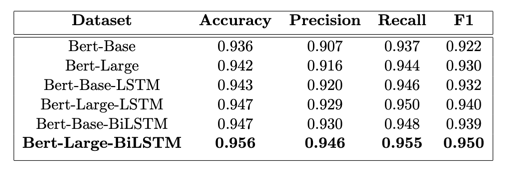
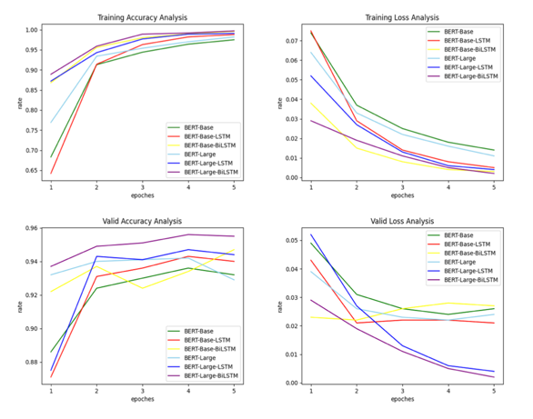
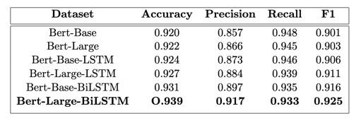

# Deep Learning-Based Methods for Argumentation Mining in Amazon Review Texts
> Author: weiyuchen

## Pretrained Model

### 1. Base Model
```text
File Name: uncased_L-12_H-768_A-12 
Description: BERT-Base, Uncased
Language Type: English
Network Structure: 12-layer, 768-hidden, 12-heads
Parameter Scale: 110M
```

### 2. Large Model
```text
File Name: 
Description: BERT-Large, Uncased
Language Type: English
Network Structure: 24-layer, 1024-hidden, 16-heads
Parameter Scale: 340M
```

## 2. Dataset

Amazon product dataset is used as the target dataset. Contains product reviews and metadata from Amazon, including 142.8 million reviews from May 1996 to July 2014.

| Number | Text | Label|
|--------|-----|-----|
| 1      | Canon CLI-8 4-Pack Color Ink Tanks for Pixma printers: This ink produces great photos. The price was right, and they arrived in just a few days. I’d do it again, and that says it all! | Support|
| 2      | Thanks to Marilu. The book talks to you like a good friend- not a doctor who talks above you. She has also written lots of follow up books to help you even more with recipes and holidays. Her website marilu.com is the biggest help and she offers wonderful online classes that support all of her program. She is full of energy and common sense advice. She has a wonderful on-line community where there is lots of support and Marilu is very involved. Marilu and her Total Health Makeover have changed my life. Thank you!!!!|Support|
| 3      | Boring book: You can pass the class without this book as long as your instructor uses blackboard. Most useless book, boring to read, unexciting, common sense information, ans reads like a novel instead of a text book. It was cheaper than the campus price, but still not worth 5.00.|Attack|
| 4      | I didn’t care for this book: This book didn’t make that much sense to me as far as a plot goes. It was mainly pornography. I like steamy scenes as much as anybody but after a while, for me, the repeated sex got tiring. Merinus (not a very attractive name) was a contradiction. She claimed to be able to do the job of tracking down Callan Lyons and getting him to open up to her. She finally talks her stubborn brothers, who were major irritants, into letting her do this and then she proceeds to make so many blunders that it was hard to take her seriously. Perhaps this book wasn’t the right one to read first as this is a series but the plot just wasn’t there. There was a bit of disjointed story in between bouts of sex. I liked Callan but Merinus was also an irritant. There was just no meat to this story. If you like steamy sex scenes and plenty of them, then this is the book for you. If you like a plot too, then maybe this isn’t one you’ll enjoy. |Attack|

```text
Train Dataset from: X. Zhang, J. Zhao, and Y. LeCun, “Character-level convolutional networks for text classification,” Advances in neural information processing systems, vol. 28, 2015.
Test Dataset from: O. Toledo-Ronen, R. Bar-Haim, and N. Slonim, “Expert stance graphs for computa- tional argumentation,” in Proceedings of the Third Workshop on Argument Mining (ArgMining2016), pp. 119–123, 2016.
```

## 3. Model
### (1) The training situation of different models is compared with the experimental results (validation set)

### (2) Accuracy and loss changes during training and validation

### (3) Comparison results of the performance of different models in the identification of argumentative relations on the test set


## 4. How to run

### (1) BERT

Install dependencies

```shell
pip install -r requirements.txt
```

Training:

```shell
cd ../am4r/core/bert
python train.py
```

Recognizing:

```shell
python predict.py
```

### (2) BERT-BiLSTM

Install dependencies

```shell
pip install -r requirements.txt
```

Training:

```shell
cd ../am4r/core/lstm
python train.py
```

Recognizing:

```shell
python predict.py
```